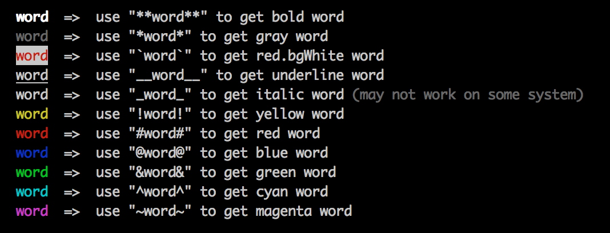

# ylog
[](https://npmjs.org/package/ylog)
[![Build Status][travis-image]][travis-url]
[![Dependency Status][daviddm-url]][daviddm-image]
[![Code Climate][climate-image]][climate-url]
[![Coverage Status][coveralls-image]][coveralls-url]

<!--
[![GitHub version][git-tag-image]][project-url]
-->


Why another logger? That's a good question!




## Install


```bash
npm install --save ylog
```


## Usage


## API

_(Coming soon)_


## Contributing

In lieu of a formal styleguide, take care to maintain the existing coding style. Add unit tests for any new or changed functionality. Lint and test your code using [gulp](http://gulpjs.com/).


## History

[CHANGELOG](CHANGELOG.md)


## License

Copyright (c) 2015 Zhonglei Qiu. Licensed under the MIT license.


[project-url]: https://github.com/qiu8310/ylog
[git-tag-image]: http://img.shields.io/github/tag/qiu8310/ylog.svg
[climate-url]: https://codeclimate.com/github/qiu8310/ylog
[climate-image]: https://codeclimate.com/github/qiu8310/ylog/badges/gpa.svg
[travis-url]: https://travis-ci.org/qiu8310/ylog
[travis-image]: https://travis-ci.org/qiu8310/ylog.svg?branch=master
[daviddm-url]: https://david-dm.org/qiu8310/ylog.svg?theme=shields.io
[daviddm-image]: https://david-dm.org/qiu8310/ylog
[coveralls-url]: https://coveralls.io/r/qiu8310/ylog
[coveralls-image]: https://coveralls.io/repos/qiu8310/ylog/badge.png

