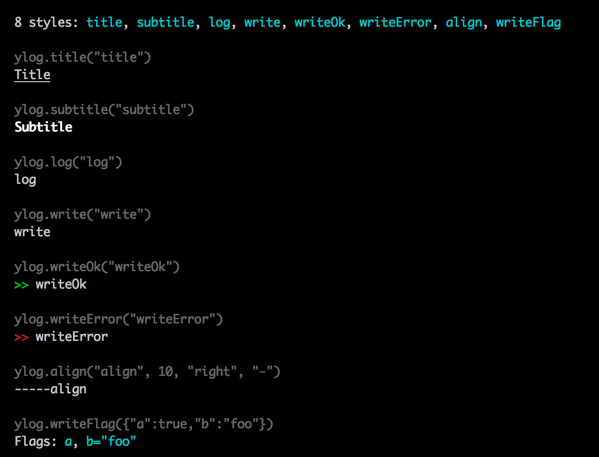

# ylog
[](https://npmjs.org/package/ylog)
[![Build Status][travis-image]][travis-url]
[![Dependency Status][daviddm-url]][daviddm-image]
[![Code Climate][climate-image]][climate-url]
[![Coverage Status][coveralls-image]][coveralls-url]

<!--
[![GitHub version][git-tag-image]][project-url]
-->


Why another logger? That's a good question!


__ylog 的特点__

  - 支持 [npmlog](https://github.com/npm/npmlog#loglevelprefix-message-) 的 level 级别
  - 支持 [debug][debug] 的多模块控制
  - 支持 自定义 [grunt log](http://gruntjs.com/api/grunt.log) 的丰富样式
  - 支持 指定每行的输出宽度 (wrap)
  - 支持 简单的类似于 markdown 的语法
  - 支持 显示执行时间
  - 支持 显示进程 ID
  - 支持 事件监听
  - 支持 进度条 输出 (使用  ) @TODO
  

## Usage

### 使用 Levels


#### 默认支持的 levels
```js
ylog.silly("silly") 
// => [S] silly

ylog.verbose("verbose") 
// => [V] verbose

ylog.debug("debug") 
// => [D] debug

ylog.info("info") 
//=> ℹ  info

ylog.warn("warn") 
// => !  warn

ylog.ok("ok")
// => ✓  ok

ylog.error("error") 
// => ✗  error

ylog.fatal("fatal") 
// => ✗✗✗ fatal

ylog.silent("silent") 
// => (nothing)
``` 

### 设置 level 显示级别：`ylog.setLevel(levels, mode)`

`levels` 可以是单个 level，也可以是一个 level 数组
`mode` 可以是 `'only'` 或 `'weight'`

  - `only mode`: 表示只输出 levels 中指定的级别，其它级别不输出
  - `weight mode`: 表示只输出权重__大于等于__所有指定 levels 中的最低权重的级别

   
### 自定义新的 level，或修改现有 level： `ylog.levelFlag(name, weight, tag)`

```js

// 修改
c.levelFlag('ok', 5000, 'ok');

// 添加
c.levelFlag('ok2', 5500, chalk.bold.green('✓'));

```


### 使用 namespace

很简单，像使用 [debug][debug] 一样，只是环境变量名从 `DEBUG` 变成了 `YLOG`

```js
var ns1 = ylog('ns_1');
var ns2 = ylog('ns_2');
var ns3 = ylog('ns_3');
var ns4 = ylog('ns_4');

ns1.ok('ok');
ns2.write('write');
ns3.error('error');
ns4.title('title');

// 然后如果使用 YLOG="ns*,-ns_3" node path/to/file.js 运行上面脚本，就只会得到第 1, 2, 4 条日志
```

### 使用类 grunt.log 丰富的样式



### 自定义你自己的样式 ylog.styleFlag(name, fn)

`name`： 是样式名称

`fn`： 的参数是你执行是填的参数，fn 需要返回一个字符串

```js

// 定义一个简单的换行样式（默认有个 ln，它输出的换行是在左边)

ylog.styleFlag('rightLn', function(str) {
  return (str || '') + '\n';
})

// 现在你就可以这样用

ylog.rightLn('are you ok');

```


### 使用类 markdown 语法


### 配置（或者叫 attribute）


#### 局部配置

有两种方式：

- `ylog.attr({md: true, time: false, wrap: 80}).log('...')`
- `ylog.md.no.time.wrap(80).log('...');`


#### 全局配置

你可以使用 `ylog.attributes` 对像，直接修改属性的默认值，它会影响全局的配置


### 显示执行时间

只要打开全局配置 time 来即可

```js
ylog.attributes.time = true;
```


### 显示进程 ID

配置 ylog.Tag 属性

```js
ylog.Tag.pid.show = true;
```


### 事件监听

```js

var logger = ylog('myNamespace');

logger.on('myNamespace.ok', function() {

});

logger.ok('ok');      // => 会触发上面的监听
logger.info('info');  // => 不会触发上面的监听


```


## History

[CHANGELOG](CHANGELOG.md)


## License

Copyright (c) 2015 Zhonglei Qiu. Licensed under the MIT license.


[debug]: https://github.com/visionmedia/debug
[project-url]: https://github.com/qiu8310/ylog
[git-tag-image]: http://img.shields.io/github/tag/qiu8310/ylog.svg
[climate-url]: https://codeclimate.com/github/qiu8310/ylog
[climate-image]: https://codeclimate.com/github/qiu8310/ylog/badges/gpa.svg
[travis-url]: https://travis-ci.org/qiu8310/ylog
[travis-image]: https://travis-ci.org/qiu8310/ylog.svg?branch=master
[daviddm-url]: https://david-dm.org/qiu8310/ylog.svg?theme=shields.io
[daviddm-image]: https://david-dm.org/qiu8310/ylog
[coveralls-url]: https://coveralls.io/r/qiu8310/ylog
[coveralls-image]: https://coveralls.io/repos/qiu8310/ylog/badge.png

