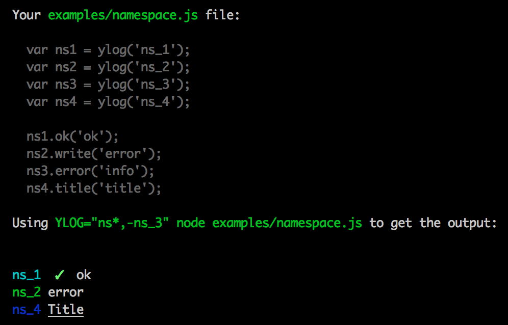
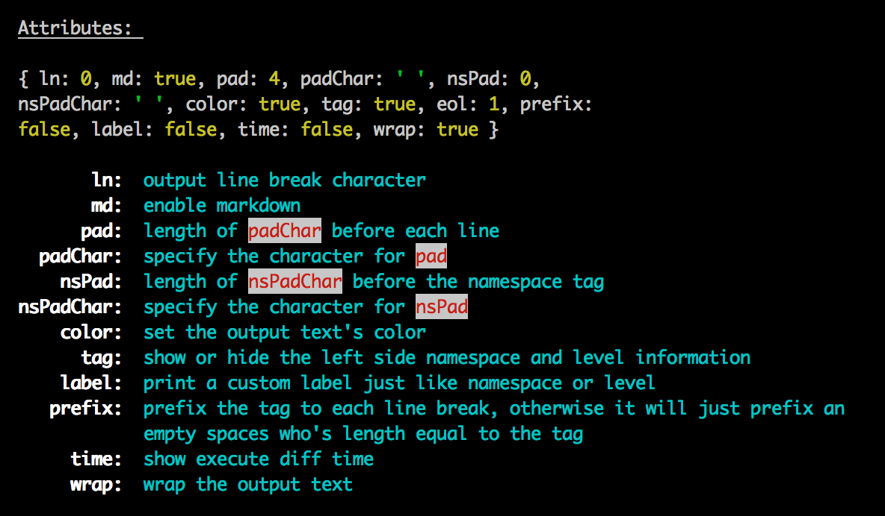

# ylog
[](https://npmjs.org/package/ylog)
[![Build Status][travis-image]][travis-url]
[![Dependency Status][daviddm-url]][daviddm-image]
[![Code Climate][climate-image]][climate-url]
[![Coverage Status][coveralls-image]][coveralls-url]
<!--
[![GitHub version][git-tag-image]][project-url]
-->

Why another logger? That's a good question!

__Example:__


__ylog 的特点:__

  - 支持 [npmlog](https://github.com/npm/npmlog#loglevelprefix-message-) 的 level 级别
  - 支持 [debug][debug] 的多模块控制
  - 支持 自定义 [grunt log](http://gruntjs.com/api/grunt.log) 的丰富样式
  - 支持 指定每行的输出宽度 (wrap)
  - 支持 简单的类似于 markdown 的语法
  - 支持 显示执行时间
  - 支持 显示进程 ID
  - 支持 事件监听
  - 支持 进度条 输出 (使用了 [gauge](https://github.com/iarna/gauge) 和 [are-we-there-yet](https://www.npmjs.com/package/are-we-there-yet)  )


## TODO


- [ ] 在输出某个对象时，可以排除某些 key 不输出，或只输出某些 key
- [ ] 支持 browser（最好兼容 浏览器中 console 中的大部分方法，如 group/table/样式设置/profile）
- [ ] 支持外部 level 优先级对比
- [ ] 支持外部 判断是否当前可以输出某个级别的日志 ylog.fatal(function () {});
- [ ] 不同的 namespace 可以设置不同的 level 级别，还要支持全局设置，还要支持在命名空间之间随意切换
- [ ] 支持输出 table、list 的样式
- [ ] 支持输出列表，并且可以分级别
- [ ] 优化 padding，支持对输出的任何字段进行 padding 处理
- [ ] 强制在执行 end 或 ln 才换行，否则永远都不自动换行
- [ ] 优化 markdown
  - [ ] 支持根据不同的条件切换不同的 md
  - [ ] md 的标识不要使用特殊字符，太难记了，最好也支持字符串表示法
  - [ ] md 的首个标识前面，或末个标识的后面不需要强制加上空格
- [ ] 添加更多的 style，另外注意 style 和 md 混合时的处理方法
- [ ] 输出对象时要有换行效果，不要一股脑的放在一行上
- [ ] %o, %j, %s, %d 好像没什么作用，优化下，并给它们加上默认的颜色
- [ ] 需要有 format 功能，保证参数达到一定的长度
- [ ] 可以指定对一个对象自动取值的操作，像 toString(), inspect() 这样，可以给对象定义一个 ylog 方法
- [ ] 不仅要能替换 %o 这些值，还要支持 %{someObjKey} 这种形式
- [ ] 支持保存变量，下次输出的时候可以直接取出来，与 %{someObjKey} 结合
- [ ] 添加 mute 和 unmute 方法，快速禁止或开启输出
- [ ] 支持设置 stack 选项，现在 error 输出错误时都会输出其 stack ？（待定）


## Usage

### 使用 levels


### 设置 level 显示级别

`ylog.setLevel(levels, mode)`

`levels` 可以是单个 level，也可以是一个 level 数组
`mode` 可以是 `'only'` 或 `'weight'`

  - `only` mode: 表示只输出 levels 中指定的级别，其它级别不输出
  - `weight` mode: 表示只输出权重__大于等于__所有指定 levels 中的最低权重的级别（默认是此值）


### 自定义新的 level，或修改现有 level

`ylog.levelFlag(name, weight, tag)`

```js

// 修改
c.levelFlag('ok', 5000, 'ok');

// 添加
c.levelFlag('ok2', 5500, chalk.bold.green('✓'));

```


### 使用 namespace

很简单，像使用 [debug][debug] 一样，只是环境变量名从 `DEBUG` 变成了 `YLOG`



### 使用丰富的样式


### 自定义你自己的样式

`ylog.styleFlag(name, fn)`

`name`： 是样式名称

`fn`： 的参数是你执行是填的参数，fn 需要返回一个字符串

```js

// 定义一个简单的换行样式（默认有个 ln，它输出的换行是在左边)

ylog.styleFlag('rightLn', function(str) {
  return (str || '') + '\n';
})

// 现在你就可以这样用

ylog.rightLn('are you ok');

```

### 使用类 markdown 语法


### 配置（或者叫 attributes）


#### 局部配置

有两种方式：

- `ylog.attr({md: true, time: false, wrap: 80}).log('...')`
- `ylog.md.no.time.wrap(80).log('...');`


#### 全局配置

你可以使用 `ylog.attributes` 对像，直接修改属性的默认值，它会影响全局的配置


### 显示执行时间

只要打开全局配置 time 来即可

```js
ylog.attributes.time = true;
```


### 显示进程 ID

配置 ylog.Tag 属性

```js
ylog.Tag.pid.show = true;
```


### 事件监听

```js

var logger = ylog('myNamespace');

logger.on('myNamespace.ok', function() {

});

logger.ok('ok');      // => 会触发上面的监听
logger.info('info');  // => 不会触发上面的监听


```

### 使用进度条

```js
var ylog = require('ylog');
var fs = require('fs');

var p = ylog.progress('progress', {theme: 'ascii'});

var basicJob = p.addJob('job 1', 1000, 2);
basicJob.complete(10);

//basicJob progress
var sid = setInterval(function() {
  basicJob.complete(100);
}, 500);

// streamJob progress
fs.stat(__filename, function(err, stats) {
  if (err) { throw err; }

  var streamJob = p.addJob('job 2', stats.size, true);

  setTimeout(function() {
    fs.createReadStream(__filename).pipe(streamJob).on('data', function() {
      // do your thing
    });
  }, 200)

});


p.on('finished', function(name) {
  p.hide();
  console.log('finished ' + name);
  clearInterval(sid);
});

```


## History

[CHANGELOG](CHANGELOG.md)


## License

Copyright (c) 2015 Zhonglei Qiu. Licensed under the MIT license.


[debug]: https://github.com/visionmedia/debug
[project-url]: https://github.com/qiu8310/ylog
[git-tag-image]: http://img.shields.io/github/tag/qiu8310/ylog.svg
[climate-url]: https://codeclimate.com/github/qiu8310/ylog
[climate-image]: https://codeclimate.com/github/qiu8310/ylog/badges/gpa.svg
[travis-url]: https://travis-ci.org/qiu8310/ylog
[travis-image]: https://travis-ci.org/qiu8310/ylog.svg?branch=master
[daviddm-url]: https://david-dm.org/qiu8310/ylog.svg?theme=shields.io
[daviddm-image]: https://david-dm.org/qiu8310/ylog
[coveralls-url]: https://coveralls.io/r/qiu8310/ylog
[coveralls-image]: https://coveralls.io/repos/qiu8310/ylog/badge.png

